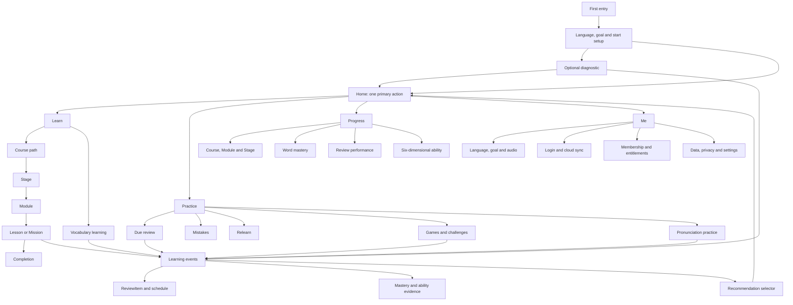
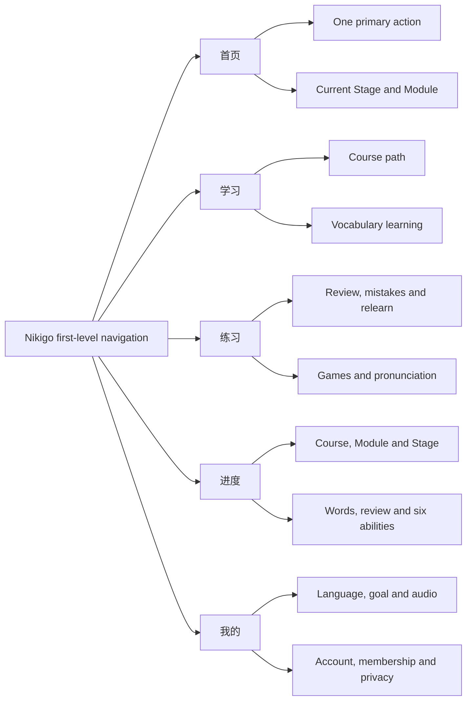

# Nikigo Future-State Product Blueprint V1

> Status: proposed for product-owner review
>
> Branch: agent/nikigo-future-state-product-blueprint-v1
>
> Source product baseline: 7056d6e3de30282396b433f261ed4dc6f4a25f3d
>
> Scope: internal product architecture, information architecture, content contracts and low-fidelity wireframes only

## 0. Executive decision

Nikigo should remain one product with five first-level destinations:

**首页 / 学习 / 练习 / 进度 / 我的**

The future product can contain onboarding, diagnosis, vocabulary, games, pronunciation practice, cloud sync, membership and privacy controls without adding more first-level navigation. The five destinations are durable responsibility boundaries, not a list of every feature.

This blueprint separates three things that must not be confused:

1. **Product map:** everything Nikigo may need in a complete product.
2. **Runtime visibility:** only current capabilities and explicitly approved next notices may appear to users.
3. **Implementation approval:** a planned screen or contract does not authorize runtime code, course files, XP changes, state migrations, audio changes or paid services.

Existing Lessons 0-13 retain their stableId, number, displayOrder, route, course content, answer data, audio policy and progress compatibility. Future lessons are expressed only as planning slots. No future lesson receives a stableId or an HTML/JS file in this phase.

## 1. Blueprint constraints and design method

### 1.1 Design read

Reading this as an internal product-architecture blueprint for product, learning and engineering review, with an evidence-first low-fidelity language. It is not a consumer-facing visual redesign.

- Design variance: 3
- Motion intensity: 1
- Visual density: 7
- Foundation: semantic HTML and native CSS in one internal artifact
- No GSAP, animation library, component library, framework migration or new production design system
- Purple remains a restrained Nikigo annotation color; the wireframe is intentionally neutral and low fidelity

The Taste skill explicitly says it is not a dashboard or multi-step product-UI system. It was therefore used only for audit discipline and anti-template checks, not for marketing-page layout rules. The UI database suggested a playful children’s-app direction and immersive full-screen pattern; both were rejected because they conflict with Nikigo’s adult multilingual learning context and this phase’s low-fidelity purpose.

Ponytail reduced the output to one blueprint document, one self-contained wireframe file and screenshot evidence. No empty course, component, service, schema or migration file was created.

The selected Garden subskill was Product Design Audit. It was used only to capture and inspect the current journey before proposing the future map. No competing visual solution was generated.

### 1.2 Future art-direction constraints

These constraints guide a later visual phase; they do not authorize UI implementation now.

- Preserve Nikigo’s purple and white recognition, but use purple to organize priority rather than tint every surface.
- Keep Hangul, example language and learning evidence visually above decoration.
- Use at most three surface levels: primary learning surface, standard grouped surface and plain rows/dividers.
- Keep one obvious gradient region at most on a page; never use gradient as the default card treatment.
- Prefer left-aligned titles and asymmetric information priority over mechanically equal card grids.
- Keep one strongest action per decision screen, especially Home and completion.
- Use plain functional copy. Avoid generic SaaS claims, motivational filler and decorative metrics.
- Mobile layouts are recomposed for 390px; they are not scaled desktop views.
- Motion is absent from the blueprint. A later motion proposal must explain a learning or state-change purpose and support reduced motion.
- Four-language text expansion, Korean glyph clarity, keyboard focus and 44px targets are release constraints, not polish.

### 1.3 Runtime visibility rule

| Status | Meaning | Allowed in internal blueprint | Allowed in formal runtime |
| --- | --- | --- | --- |
| current | Exists and is backed by current code/data | Yes | Yes |
| next | Approved candidate for the next implementation phase | Yes | Only after explicit approval; a non-clickable notice may be separately approved |
| later | Plausible future capability with unresolved content/data/policy | Yes | No |
| reserved | Boundary or entitlement placeholder without product approval | Yes | No |

Later and reserved capabilities must not appear in formal navigation, recommendations, empty cards, disabled teasers or clickable placeholders.

## 2. Current product evidence and audit

### 2.1 Capture scope

The current product was captured in a fresh local origin at 390 x 844 and 1440 x 1024 using Playwright. This avoided a stale Service Worker cache from the earlier preview origin.

Captured surfaces:

1. Home with required setup as the primary action
2. Learn with Stage, Module and Lesson grouping
3. Practice
4. Progress
5. Me
6. Diagnostic
7. Lesson 11 introduction

Console warnings/errors during the accepted capture: 0.

Evidence folders:

- Current 390px: artifacts/future-state-blueprint-v1/current/390/
- Current 1440px: artifacts/future-state-blueprint-v1/current/1440/
- Current accessibility snapshots: artifacts/future-state-blueprint-v1/current/accessibility/
- Current metrics: artifacts/future-state-blueprint-v1/current/current-metrics.json

### 2.2 Strengths to preserve

- Home already returns one strongest action and explains the current Stage/Module context.
- Learn already groups all 14 available lessons under the approved K0/K1 taxonomy.
- Practice already owns due review and relearning.
- Progress already separates summary metrics from the course path.
- Me already owns language, daily goal, audio preferences and profile settings.
- Lesson 11 has a clear introduction, visible step count, return action and primary start action.
- 390px and 1440px captures have no horizontal overflow in the accepted fresh run.
- Nikigo’s purple and white identity is visible without requiring a new design direction.

### 2.3 Structural gaps

| Area | Evidence | Severity | Decision |
| --- | --- | ---: | --- |
| Setup and diagnosis are separate experiences | Home asks for setup; diagnostic has its own visual and route but no unified lifecycle | High | Create one setup state model with optional diagnosis and explicit completion state |
| Ability values lack traceable evidence | Home shows six values, but current architecture has no common evidence ledger | High | Keep current display compatibility; future six-dimension claims require evidence events |
| Learn cannot yet represent K2-K4 or vocabulary without empty UI | Current Learn correctly shows only K0/K1 | Medium | Extend taxonomy only after approval; keep later stages internal until content exists |
| Practice is sparse when no due items exist | Current empty state is honest but does not explain future training sources | Medium | Define source contracts now; add no empty game/pronunciation entry |
| Progress is course-heavy | Current progress is valid but has no word mastery, review performance or evidence history | Medium | Add views only when those data sources exist |
| Account and cloud state do not exist | Me is local-only | High | Define guest-first sync envelope and conflict rules before UI/runtime |
| Diagnostic visual language is separate from the main app | Current diagnostic uses a different shell and denser promotional copy | Medium | Future setup/diagnostic should share product vocabulary and return path |
| Future monetization is undefined | Current Me shows Free but no entitlement model | Medium | Reserve policy boundaries only; do not price or gate current content |

Accessibility evidence limits: screenshots and DOM snapshots confirm heading order, named controls and navigation order for the accepted views. They do not prove full screen-reader behavior, contrast compliance, zoom behavior or every keyboard transition.

## 3. Complete product map

## 4. Five-navigation ownership

| Destination | Owns | Does not own |
| --- | --- | --- |
| 首页 | Required setup entry, exactly one primary action, current Stage/Module, short status summary | Full catalog, multiple competing recommendations, settings forms |
| 学习 | Course path, Stage/Module browsing, all available lessons, future vocabulary | Due-review queue, ability report, account settings |
| 练习 | Due review, mistakes, relearn, future games and pronunciation | Primary course progression, empty future teasers |
| 进度 | Course/Module/Stage evidence, vocabulary mastery, review performance, six-dimensional ability | Promotional recommendations, unsupported scores |
| 我的 | Four-language preference, goal, audio, account/sync, membership, privacy | Course catalog, game list, primary next lesson |

## 5. K0-K4 Stage framework

### 5.1 Stage containers

| stageId | zh | en | vi | ja | Stage goal | Estimated lesson slots | Checkpoint | Status |
| --- | --- | --- | --- | --- | --- | ---: | --- | --- |
| K0 | 韩文基础 | Hangul Foundations | Nền tảng Hangul | ハングル基礎 | Understand Hangul structure, basic decoding, sound contrasts, batchim and a first integrated scenario | 11 current | lesson-10 remains the current K0 challenge | current |
| K1 | 基础沟通 | Essential Korean | Giao tiếp tiếng Hàn cơ bản | 韓国語の基本コミュニケーション | Exchange identity, origin, language, numbers and other essential short-form information | 3 current + 7-10 planning slots | Planned K1 checkpoint | current plus next/later slots |
| K2 | 日常生活 | Everyday Life | Cuộc sống hằng ngày | 日常生活 | Handle routines, food, shopping, home, health and appointments | 14-18 planning slots | Planned K2 checkpoint | later |
| K3 | 旅行与社交 | Travel and Social Korean | Tiếng Hàn du lịch và giao tiếp xã hội | 旅行と交流の韓国語 | Navigate transport, accommodation, plans, invitations and social exchanges | 15-18 planning slots | Planned K3 checkpoint | later |
| K4 | 职场与自然表达 | Work and Natural Expression | Công việc và diễn đạt tự nhiên | 職場と自然な表現 | Collaborate at work, manage register, explain opinions and understand more natural connected speech | 15-20 planning slots | Planned K4 checkpoint | reserved |

Stage order affects recommendation and display only. It never blocks entry to any available content.

### 5.2 Modules

User-facing module names require zh/en/vi/ja copy before release. The Chinese goal below is the product scope anchor; translated goals must be approved with the module content rather than machine-inferred at runtime.

| Stage | chapterId or planningModuleId | Module names zh / en / vi / ja | Learning goal | Slots | Gate / checkpoint | Status |
| --- | --- | --- | --- | ---: | --- | --- |
| K0 | k0-hangul-map-and-vowels | 韩文地图与基础元音 / Hangul Map and Core Vowels / Bản đồ Hangul và nguyên âm cơ bản / ハングル全体図と基本母音 | Understand Hangul’s map and read core/easily confused vowels in syllables and first words | 3 current | No completion gate | current |
| K0 | k0-consonants-syllables-compound-vowels | 辅音、音节块与复合元音 / Consonants, Syllable Blocks, and Compound Vowels / Phụ âm, khối âm tiết và nguyên âm ghép / 子音・音節ブロック・複合母音 | Distinguish frequent consonants, sound contrasts, syllable layouts and compound vowels | 4 current | Lesson 6 required-audio completion gate | current |
| K0 | k0-batchim-and-sound-changes | 收音与常见音变 / Final Consonants and Common Sound Changes / Âm cuối và các biến âm thường gặp / パッチムとよくある音変化 | Recognize basic finals, representative finals, linking and nasalization | 2 current | No completion gate | current |
| K0 | k0-integrated-use-and-checkpoint | 综合应用与K0阶段挑战 / Integrated Use and the K0 Checkpoint / Vận dụng tổng hợp và thử thách K0 / 総合活用とK0チェックポイント | Apply K0 learning in greeting/introduction tasks and complete the existing challenge | 2 current | lesson-10 challenge | current |
| K1 | k1-identity-and-language-background | 姓名、身份与语言背景 / Names, Identity, and Language Background / Tên, thân phận và nền tảng ngôn ngữ / 名前・立場・言語背景 | Ask and state name, identity, origin and learning language politely | 2 current | No completion gate | current |
| K1 | k1-numbers-and-quantities | 数字与基础数量 / Numbers and Basic Quantities / Số và số lượng cơ bản / 数字と基本的な数量 | Use native numbers and basic quantities; later expansion may cover other number systems only after approval | 1 current + 2-3 planning slots | No current gate | current plus next/later |
| K1 | plan:k1-basic-courtesy-exchanges | 基本礼貌与日常交换 / Basic Courtesy and Everyday Exchanges / Phép lịch sự và trao đổi hằng ngày / 基本の丁寧表現と日常のやり取り | Make short requests, thanks, apologies and confirmations | 3-4 | Planned module checkpoint | later |
| K1 | plan:k1-time-location-plans | 时间、地点与简单计划 / Time, Place, and Simple Plans / Thời gian, địa điểm và kế hoạch đơn giản / 時間・場所・簡単な予定 | Exchange basic time/location information and make simple plans | 3-4 | Feeds K1 checkpoint | later |
| K1 | plan:k1-stage-checkpoint | K1阶段检查 / K1 Checkpoint / Kiểm tra giai đoạn K1 / K1チェックポイント | Verify essential communication evidence and recommend K2 without locking it | 1 | stage-checkpoint | later |
| K2 | plan:k2-routines-time | 日常作息与时间 / Routines and Time / Thói quen và thời gian / 日課と時間 | Describe daily routines, frequency and schedules | 3-4 | None | later |
| K2 | plan:k2-food-ordering | 饮食与点餐 / Food and Ordering / Ăn uống và gọi món / 食事と注文 | Read basic menus, order, modify and confirm food requests | 3-4 | Audio readiness required for listening tasks | later |
| K2 | plan:k2-shopping-services | 购物与生活服务 / Shopping and Everyday Services / Mua sắm và dịch vụ hằng ngày / 買い物と生活サービス | Ask prices, quantities, availability and service help | 3-4 | None | later |
| K2 | plan:k2-home-health-appointments | 住居、健康与预约 / Home, Health, and Appointments / Nhà ở, sức khỏe và lịch hẹn / 住まい・健康・予約 | Handle basic home issues, symptoms and appointments | 3-4 | Privacy-safe content review | later |
| K2 | plan:k2-stage-checkpoint | K2阶段检查 / K2 Checkpoint / Kiểm tra giai đoạn K2 / K2チェックポイント | Verify everyday-life task performance and generate next recommendations | 1 | stage-checkpoint | later |
| K3 | plan:k3-transport-directions | 交通与问路 / Transport and Directions / Giao thông và hỏi đường / 交通と道案内 | Navigate transport, routes, tickets and directions | 3-4 | Listening audio must be approved | later |
| K3 | plan:k3-accommodation-travel | 住宿与旅行事务 / Accommodation and Travel Tasks / Lưu trú và công việc du lịch / 宿泊と旅行手続き | Check in, ask about facilities and solve common travel issues | 3-4 | Scenario content review | later |
| K3 | plan:k3-invitations-plans | 邀请与共同计划 / Invitations and Shared Plans / Lời mời và kế hoạch chung / 誘いと共同の予定 | Invite, accept, decline and negotiate plans politely | 3 | None | later |
| K3 | plan:k3-social-conversation | 社交对话 / Social Conversation / Hội thoại xã giao / 社交会話 | Maintain short social conversations and show interest naturally | 3-4 | Speaking evidence requires separate approval | later |
| K3 | plan:k3-problem-solving | 旅行问题处理 / Travel Problem Solving / Xử lý vấn đề khi du lịch / 旅行中の問題対応 | Clarify misunderstandings and request practical help | 2-3 | Sensitive-scenario review | later |
| K3 | plan:k3-stage-checkpoint | K3阶段检查 / K3 Checkpoint / Kiểm tra giai đoạn K3 / K3チェックポイント | Verify travel/social mission evidence and recommend K4 | 1 | stage-checkpoint | later |
| K4 | plan:k4-workplace-basics | 职场基础 / Workplace Foundations / Nền tảng nơi làm việc / 職場の基礎 | Introduce roles, tasks, schedules and workplace needs | 3-4 | None | reserved |
| K4 | plan:k4-collaboration-meetings | 协作与会议 / Collaboration and Meetings / Hợp tác và cuộc họp / 協働と会議 | Clarify tasks, agree actions and participate in simple meetings | 3-4 | Scenario evidence review | reserved |
| K4 | plan:k4-register-politeness | 敬语层级与语境 / Register and Politeness / Cấp độ lịch sự và ngữ cảnh / 敬語レベルと文脈 | Choose appropriate register across workplace and social contexts | 3-4 | High editorial review requirement | reserved |
| K4 | plan:k4-opinions-stories | 观点、理由与叙述 / Opinions, Reasons, and Narratives / Ý kiến, lý do và kể chuyện / 意見・理由・説明 | Explain opinions, reasons, past events and next actions | 3-4 | None | reserved |
| K4 | plan:k4-natural-speech | 自然听力与连贯表达 / Natural Listening and Connected Expression / Nghe tự nhiên và diễn đạt liền mạch / 自然な聞き取りとまとまりのある表現 | Understand connected speech and improve intelligibility without claiming native-like pronunciation | 3-4 | Audio, recording and privacy approval | reserved |
| K4 | plan:k4-stage-checkpoint | K4阶段检查 / K4 Checkpoint / Kiểm tra giai đoạn K4 / K4チェックポイント | Summarize evidence across the program and recommend continued learning | 1 | stage-checkpoint | reserved |

### 5.3 Recommended order, free entry and extension

- Stage and Module order guide recommendation and default expansion.
- Lesson displayOrder remains the ordering source within approved current modules.
- All available content remains freely enterable regardless of prerequisites, stage completion or membership.
- Future planningModuleId values are blueprint identifiers, not runtime chapterId values.
- A planning slot receives a stableId only when real content, route, localization, answer data, audio requirements and migration impact are approved.
- A new lesson never retroactively locks later content, deletes historical completion, reclaims XP or changes a historical completion date.
- Module completion is versioned with taxonomyVersion, historicalCompletion, historicalCompletedAt, currentVersionProgress and newContentAvailable.
- Lesson 6 remains visible and freely enterable as preview while gated. Its module may show “3/4, current completable content learned, 1 lesson audio preparing,” never ordinary 4/4 completion.

## 6. Current and future course catalog skeleton

### 6.1 Existing Lessons 0-13

| Order | stableId | Current title | Stage | Approved chapterId | Explicit current type | Runtime status |
| ---: | --- | --- | --- | --- | --- | --- |
| 0 | lesson-00 | 先认识韩文字母地图 | K0 | k0-hangul-map-and-vowels | foundation-lesson | current, available, 0 XP |
| 1 | lesson-01 | 核心元音 ㅏㅓㅗㅜㅡㅣ | K0 | k0-hangul-map-and-vowels | foundation-lesson | current, available |
| 2 | lesson-02 | 其余基础元音和易混元音 | K0 | k0-hangul-map-and-vowels | foundation-lesson | current, available |
| 3 | lesson-03 | 高频基础辅音：通过完整音节学习 | K0 | k0-consonants-syllables-compound-vowels | foundation-lesson | current, available |
| 4 | lesson-04 | 听懂普通音、送气音和紧音 | K0 | k0-consonants-syllables-compound-vowels | foundation-lesson | current, available |
| 5 | lesson-05 | 看懂韩语音节块 | K0 | k0-consonants-syllables-compound-vowels | foundation-lesson | current, available |
| 6 | lesson-06 | 复合元音 | K0 | k0-consonants-syllables-compound-vowels | foundation-lesson | current preview; required-audio completion gate |
| 7 | lesson-07 | 四个基础收音 ㄴㅁㅇㄹ | K0 | k0-batchim-and-sound-changes | foundation-lesson | current, available |
| 8 | lesson-08 | 七种代表收音和常见音变 | K0 | k0-batchim-and-sound-changes | foundation-lesson | current, available |
| 9 | lesson-09 | 场景韩语：问候与介绍 | K0 | k0-integrated-use-and-checkpoint | scenario-mission | current, available |
| 10 | lesson-10 | K0阶段复习挑战 | K0 | k0-integrated-use-and-checkpoint | practice-game | current, available |
| 11 | lesson-11 | 姓名与身份 | K1 | k1-identity-and-language-background | scenario-mission | current, available |
| 12 | lesson-12 | 国家与语言 | K1 | k1-identity-and-language-background | scenario-mission | current, available |
| 13 | lesson-13 | 固有数词1-10与基础数量 | K1 | k1-numbers-and-quantities | foundation-lesson | current, available |

This table mirrors the explicit content-type-map and approved taxonomy. It does not infer type, chapter or skill tags from titles.

### 6.2 Future slot families

| Slot family | Stage | Estimated slots | Allowed content types | Stable IDs now? | Runtime files now? |
| --- | --- | ---: | --- | --- | --- |
| K1 number expansion | K1 | 2-3 | foundation-lesson, scenario-mission | No | No |
| K1 courtesy and plans | K1 | 6-8 | scenario-mission, vocabulary-session | No | No |
| K1 checkpoint | K1 | 1 | stage-checkpoint | No | No |
| K2 modules | K2 | 14-18 | scenario-mission, vocabulary-session, review-session, stage-checkpoint | No | No |
| K3 modules | K3 | 15-18 | scenario-mission, vocabulary-session, practice-game, pronunciation-practice, stage-checkpoint | No | No |
| K4 modules | K4 | 15-20 | scenario-mission, vocabulary-session, pronunciation-practice, review-session, stage-checkpoint | No | No |

## 7. Common content contract

The future contract is conceptual in this phase. It does not replace course-catalog.js, app-state.js, audio-catalog.js or lesson engines.

| Field | Purpose | Compatibility rule |
| --- | --- | --- |
| contentId / stableId | Permanent content identity | Existing lesson-00 through lesson-13 never change |
| contentType | One approved type from the registry | Explicit mapping only; never infer from title/template |
| taxonomyVersion | Versioned Stage/Module assignment | Historical completion remains attached to its version |
| stageId | K0-K4 container | Display/recommendation only, not access gate |
| chapterId | Explicit approved Module | No runtime inference |
| displayOrder | Recommended display order | Existing values remain exact |
| locales | zh/en/vi/ja names, goals and instruction copy | Missing required locale blocks release |
| skillTags | Approved ability dimensions/skills | Empty until content review; never template-generated |
| estimatedMinutes | User expectation | Editorial metadata, not completion evidence |
| availability | current/next/later/reserved plus release/access state | Only real available content is enterable |
| audioReadiness | Exact approved audio records and completion gate | Fail closed; no device TTS substitution |
| completionPolicy | Required steps/evidence and gate | Preserves current completion and Lesson 6 gate |
| xpPolicyId | Explicit XP policy | New policies need approval and fixtures |
| reviewPolicyId | ReviewItem generation and scheduling | Stable IDs, deduplication and source traceability required |
| recommendedNext | Editorial recommendation candidates | Never an access gate; selector still returns one primaryAction |
| masteryPolicyId | Evidence aggregation policy | No score without real events |

Common attempt output:

| Output | Minimum fields |
| --- | --- |
| LearningEvent | eventId, user/guest scope, contentId, attemptId, eventType, stepId/exerciseId, occurredAt, result, locale, taxonomyVersion |
| CompletionResult | contentId, attemptId, firstCompletion, completedAt, completionPolicyId, gateState, xpAwarded |
| ReviewItem | reviewItemId, sourceContentId, sourceExerciseId, promptVersion, errorType, createdAt, dueAt, scheduleVersion |
| AbilityEvidence | evidenceId, dimensionId, sourceEventId, strength, confidence, observedAt, policyVersion |
| RecommendationSnapshot | selectorVersion, evaluatedAt, candidates, rejectedReasons, exactly one primaryAction |

## 8. Content type contracts

| Type | User purpose and page structure | Input | Output | XP approval | ReviewItem | Ability evidence | Today training |
| --- | --- | --- | --- | --- | --- | --- | --- |
| foundation-lesson | Learn a language foundation through intro, guided steps, exercises, feedback and completion | Explicit lesson config, localized instruction, exercises, approved audio references, completion policy | Step progress, attempts, completion, errors, evidence | Existing lessons keep current policy; any new foundation policy needs explicit metadata and regression fixtures | Wrong reviewable exercise creates a stable source-linked item | Reading, listening, form/grammar and pronunciation-awareness evidence as explicitly tagged | Unfinished lesson may resume; due foundation items enter review |
| scenario-mission | Complete a practical communicative task through context, model, choices, feedback and mission completion | Scenario, roles, language functions, localized support, reviewed audio, exercises | Mission progress, choices, completion, errors, communication evidence | Existing lesson policy stays; future mission awards need approval | Wrong/low-confidence mission decisions create source-linked items | Listening, grammar/form, vocabulary and communication evidence | Active mission can resume; due mission items enter review |
| vocabulary-session | Learn and recall a bounded word set with source context, examples and spaced retrieval | Word IDs, senses, source content, locales, examples, approved audio, scheduling policy | Recall attempts, mastery evidence, ReviewItems, session completion | Requires independent approval; no default +50 assumption | Wrong or low-confidence recall creates/deduplicates an item | Vocabulary plus listening/reading evidence when observed | Due words can form one scheduled training block |
| practice-game | Rehearse already learned material with an explicit training objective | Source item IDs, game rules, attempt limit, accessibility alternative, audio readiness | Attempts, source-linked errors, practice evidence | Requires independent approval; avoid farming and duplicate XP | Errors update the original source item or create one deduplicated source item | Only the trained, explicitly tagged dimension changes | May be selected after higher-priority due review; not a home primary by default |
| diagnostic | Estimate a start point without pretending to certify mastery | Versioned item bank, locale, prior setup, scoring/placement policy | Placement recommendation, evidence confidence, unanswered/invalid states | Expected 0 XP unless separately approved | Does not create long-term ReviewItems by default | Diagnostic evidence is labeled separately from learning evidence | May be a setup recommendation, not a recurring daily task by default |
| pronunciation-practice | Improve intelligibility through listen, record, compare and retry | Approved model audio, prompt, recording permission, privacy/retention policy, scoring policy | Recording consent state, attempt metadata, feedback, optional evidence | Requires independent approval plus cost/privacy review | Low-confidence result may schedule another prompt only after policy approval | Pronunciation evidence with model/version/confidence, never unsupported native-likeness claims | Scheduled only when audio, permission and privacy conditions are met |
| review-session | Resolve due ReviewItems and update their schedules | Due items, schedule policy, locale, source availability | Attempt results, nextDueAt, resolved/retained state, evidence | Current review semantics remain; any XP needs independent approval | Primarily updates existing items; no duplicate item per retry | Reinforcement evidence may update the source dimension | This is the default unit for due review on Home/Practice |
| stage-checkpoint | Verify integrated Stage evidence and recommend next steps without hard locking content | Approved blueprint, eligible content set, localized tasks, audio readiness, evidence policy | Checkpoint result, gaps, ReviewItems, evidence and recommendation candidates | Requires independent approval; existing lesson-10 identity and XP remain protected | Reviewable errors create source-linked items with checkpoint context | Multiple dimensions update only from real observed tasks | Eligible checkpoint can be recommended when no stronger active/due action exists |

## 9. Feature status matrix

| Capability | Current reality | Blueprint state | Formal runtime now |
| --- | --- | --- | --- |
| First entry and setup | Home can require learning setup; preferences exist in Me | next: unify setup lifecycle | Current setup action only |
| Diagnostic | diagnostic.html exists as a separate experience | next: connect lifecycle and evidence policy | Current route only |
| Home | One primary action and current path context exist | current | Yes |
| Learn | K0/K1 grouped path and free entry exist | current | Yes |
| Stage/Module pages | Grouped Learn view exists; dedicated detail pages do not | next | No separate runtime pages yet |
| Existing Lessons 0-13 | Real content and routes exist | current | Yes |
| Vocabulary learning and wordbook | No formal runtime | later | No |
| Due review, mistakes and relearn | Current review/relearn capabilities exist with uneven publication coverage | current plus next data coverage | Current capabilities only |
| Games/challenges | lesson-10 is a current practice-game; no general game hub | later | lesson-10 only |
| Stage checkpoint type | lesson-10 is current; reusable contract not implemented | next | No generic entry |
| Progress | Course/XP/path progress exists | current | Yes |
| Six-dimensional evidence | Display values exist; shared evidence ledger does not | next | Do not claim traceable mastery yet |
| Me/settings | Language, goal, audio and profile exist | current | Yes |
| Login/cloud sync | No current account sync | later | No |
| Membership/entitlements | Free label only; no approved entitlement model | reserved | No |
| Audio playback gate | Exact approved catalog and Lesson 6 gate exist | current | Yes |
| Pronunciation recording/feedback | No approved runtime, privacy policy or model | later | No |
| Data export/delete/privacy center | No complete product surface | later | No |

## 10. User state and Home recommendation matrix

The selector always returns exactly one primaryAction.

| State | Required evidence | Primary action | Secondary placement | Guardrail |
| --- | --- | --- | --- | --- |
| Required setup incomplete | Missing required language/start settings | Complete learning setup | Diagnostic may be offered inside setup | No course-title guess or fake placement |
| Setup complete, diagnosis desired | User explicitly chose diagnosis | Start/continue diagnostic | Free learning remains available | Product owner must decide whether diagnosis is optional or required for specific choices |
| Clear active unfinished course | Reliable resumable session or trustworthy lastActivityAt | Resume active course | Other unfinished courses appear under Learn/learning-in-progress | Active evidence must be explicit |
| Due review, no active course | At least one due ReviewItem | Start due review | Learn remains freely available | Review outranks historical unfinished courses |
| Multiple historical unfinished, no reliable activity | Several incomplete histories but no reliable recent session | Start due review if due; otherwise recommended next | Historical items appear secondarily | Never guess from title or highest percentage |
| No active course or due review | Approved path candidate available and formally completable | Start recommended next available content | Full path entry | Lesson 6 gated preview is not a formally completable recommendation |
| Lesson 6 is next by order but gate closed | lesson-06 available as preview, completion gate closed | Recommend the next formally completable candidate, such as lesson-07 | Show lesson-06 in Learn as preview/audio preparing | Do not hide, auto-complete, award XP or block later content |
| Eligible Stage checkpoint | Checkpoint content exists and selector policy says it is the next path item | Start checkpoint | Free content entry remains | Checkpoint is not an access gate |
| Current Stage complete, next Stage available | Versioned completion and next Stage content available | Start first approved next-Stage content or checkpoint per approved policy | Show Stage summary | Never retroactively reopen completed history because of new content |
| Path recommendation cannot be formed | Missing/invalid taxonomy or no suitable candidate | Choose from all available courses | Explain that free choice is available | Fail safely, do not invent a lesson |
| Current released path complete | No formally completable recommended content | Review progress and choose freely | Practice due items still outrank this if present | Do not show later/reserved content as clickable |

Existing approved priority remains:

**required setup → active unfinished course → due review → recommended next formally completable content → free choice**

## 11. Core page responsibilities

| Screen | User goal | Primary action | Must preserve | Must not show |
| --- | --- | --- | --- | --- |
| First entry/setup | Establish language, start and goal | Save required setup | Four languages, free entry, editable settings | Marketing overload, forced diagnosis |
| Home | Know what to do now | One selector result | Stage/Module context, Lesson 6 gate, current stats | Multiple equal CTAs, full catalog |
| Learn overview | Understand the whole available path | Open current Stage/path | All 14 free entries and explicit grouping | Clickable K2-K4 or vocabulary without content |
| Stage | Understand one Stage and its Modules | Open current Module | Localized name/goal and versioned progress | Bare K0/K1 as the only label |
| Module | Understand goals and lessons | Enter a real available lesson | displayOrder, gates, historical/current progress | Empty future lesson routes |
| Course intro | Decide to start/resume | Start or resume | XP rule, audio state, relearn and return | Full lesson content dump |
| Course play | Learn and answer | Submit/check current step | Feedback, keyboard, restore, audio gate | Unrelated dashboard metrics |
| Course complete | Confirm outcome and next step | One next recommendation | First +50, repeat +0, ReviewItems, refresh safety | Multiple competing next CTAs |
| Vocabulary learning | Recall a bounded word set | Record recall confidence/answer | Source, locale, audio gate and scheduling | Fake mastery from one tap |
| Wordbook | Find learned words and status | Search/filter | Real learned items and evidence | Planned/unreleased vocabulary |
| Practice center | Clear due work | Start due review | Mistakes, relearn and schedule | Empty games/pronunciation teasers in runtime |
| Game entry | Choose a real practice objective | Start available game | Source linkage and accessible alternative | Decorative/farmable games |
| Stage checkpoint | Verify integrated ability | Start checkpoint | Free entry, retry, evidence, ReviewItems | Hard Stage lock |
| Progress | Understand verified progress | Inspect evidence | Historical completion and current version | Unsupported mastery claims |
| Six abilities | Understand strengths and gaps | Open evidence details | Source, confidence and date | Fake precision or title-inferred tags |
| Me | Configure Nikigo | Save a setting | Language, goal, audio and local identity | Course catalog or primary recommendations |
| Login/sync | Continue safely across devices | Sign in and preview merge | Local-first operation and conflict recovery | Silent overwrite |
| Membership | Understand approved entitlements | None until commercial approval | Existing available access and audio safety | Pricing/payment in this phase |

## 12. Wireframe inventory

The self-contained internal preview is:

[Open the internal future-state preview](http://127.0.0.1:4175/artifacts/future-state-blueprint-v1/wireframes.html?screen=home)

The preview uses the five formal navigation destinations only. Future screens are opened by direct internal blueprint URLs for review, not through formal runtime navigation.

| # | Screen | Status | Query | 390 x 844 | 1440 x 1024 |
| ---: | --- | --- | --- | --- | --- |
| 1 | First entry/setup | next | screen=onboarding | [390](artifacts/future-state-blueprint-v1/future/390/01-onboarding.png) | [1440](artifacts/future-state-blueprint-v1/future/1440/01-onboarding.png) |
| 2 | Home | current | screen=home | [390](artifacts/future-state-blueprint-v1/future/390/02-home.png) | [1440](artifacts/future-state-blueprint-v1/future/1440/02-home.png) |
| 3 | Learn overview | current | screen=learn | [390](artifacts/future-state-blueprint-v1/future/390/03-learning-overview.png) | [1440](artifacts/future-state-blueprint-v1/future/1440/03-learning-overview.png) |
| 4 | Stage | next | screen=stage | [390](artifacts/future-state-blueprint-v1/future/390/04-stage.png) | [1440](artifacts/future-state-blueprint-v1/future/1440/04-stage.png) |
| 5 | Module | current/next boundary | screen=module | [390](artifacts/future-state-blueprint-v1/future/390/05-module.png) | [1440](artifacts/future-state-blueprint-v1/future/1440/05-module.png) |
| 6 | Course intro | current | screen=course-intro | [390](artifacts/future-state-blueprint-v1/future/390/06-course-intro.png) | [1440](artifacts/future-state-blueprint-v1/future/1440/06-course-intro.png) |
| 7 | Course play | current | screen=course-play | [390](artifacts/future-state-blueprint-v1/future/390/07-course-play.png) | [1440](artifacts/future-state-blueprint-v1/future/1440/07-course-play.png) |
| 8 | Course complete | current | screen=course-complete | [390](artifacts/future-state-blueprint-v1/future/390/08-course-complete.png) | [1440](artifacts/future-state-blueprint-v1/future/1440/08-course-complete.png) |
| 9 | Vocabulary learning | later | screen=vocabulary | [390](artifacts/future-state-blueprint-v1/future/390/09-vocabulary-learning.png) | [1440](artifacts/future-state-blueprint-v1/future/1440/09-vocabulary-learning.png) |
| 10 | Wordbook | later | screen=wordbook | [390](artifacts/future-state-blueprint-v1/future/390/10-wordbook.png) | [1440](artifacts/future-state-blueprint-v1/future/1440/10-wordbook.png) |
| 11 | Practice center | current | screen=practice | [390](artifacts/future-state-blueprint-v1/future/390/11-practice-center.png) | [1440](artifacts/future-state-blueprint-v1/future/1440/11-practice-center.png) |
| 12 | Game entry | later | screen=game | [390](artifacts/future-state-blueprint-v1/future/390/12-game-entry.png) | [1440](artifacts/future-state-blueprint-v1/future/1440/12-game-entry.png) |
| 13 | Stage checkpoint | next | screen=checkpoint | [390](artifacts/future-state-blueprint-v1/future/390/13-stage-checkpoint.png) | [1440](artifacts/future-state-blueprint-v1/future/1440/13-stage-checkpoint.png) |
| 14 | Progress | current | screen=progress | [390](artifacts/future-state-blueprint-v1/future/390/14-progress.png) | [1440](artifacts/future-state-blueprint-v1/future/1440/14-progress.png) |
| 15 | Six-dimensional ability | next | screen=ability | [390](artifacts/future-state-blueprint-v1/future/390/15-six-dimensional-ability.png) | [1440](artifacts/future-state-blueprint-v1/future/1440/15-six-dimensional-ability.png) |
| 16 | Me | current | screen=me | [390](artifacts/future-state-blueprint-v1/future/390/16-me.png) | [1440](artifacts/future-state-blueprint-v1/future/1440/16-me.png) |
| 17 | Login/sync | later | screen=login | [390](artifacts/future-state-blueprint-v1/future/390/17-login-sync.png) | [1440](artifacts/future-state-blueprint-v1/future/1440/17-login-sync.png) |
| 18 | Membership | reserved | screen=membership | [390](artifacts/future-state-blueprint-v1/future/390/18-membership.png) | [1440](artifacts/future-state-blueprint-v1/future/1440/18-membership.png) |

Screenshot root: artifacts/future-state-blueprint-v1/future/

Accepted wireframe checks:

- 36 screenshots captured and visually inspected
- 0 horizontal overflow at both target widths
- 0 console warnings/errors in the accepted run
- One semantic h1 per screen
- Named language selector and profile control
- Five-item desktop and mobile navigation with active state
- 44px minimum primary controls
- Mobile bottom navigation includes safe-area padding
- Home has exactly one primary action
- Later/reserved entry buttons are disabled or absent
- No animation and no GSAP

## 13. Current-to-target gap

| Layer | Current | Target | Safe next move |
| --- | --- | --- | --- |
| Setup state | Partial settings and separate diagnostic | One explicit lifecycle with optional diagnosis | Selector/view-model work before UI |
| Content map | K0/K1, 14 real lessons | K0-K4 containers with versioned approved modules | Approve future taxonomy without runtime publication |
| Content types | Four mapped types | Eight shared contracts | Add contracts/tests only after approval |
| Review | Existing due/mistake/relearn with partial publishers | All content types produce stable source-linked ReviewItems | Normalize publishers incrementally |
| Ability | Six display values without universal evidence provenance | Six evidence-backed dimensions | Define dimensions and evidence policy first |
| Vocabulary | None | Session, wordbook, mastery and review integration | Approve vocabulary data model and one real content set |
| Games | lesson-10 only | Source-linked practice-game catalog | Approve one training objective and anti-farming XP policy |
| Pronunciation | Audio playback only | Consent-based listen/record/feedback | Privacy, retention, model, cost and accessibility review first |
| Account | Local guest state | Guest-first optional sync | Design merge rules and migration fixtures |
| Membership | No entitlement model | Reserved entitlements that cannot remove existing rights | Commercial and legal decision before UI |
| Privacy | Player privacy protections, no full center | Export/delete/recording/diagnostic controls | Inventory data and retention before interface |

## 14. Phased implementation order

### Phase A: approve the blueprint

- Approve K1 future modules and K2-K4 boundaries.
- Approve the eight content-type contracts as architecture, not runtime.
- Approve the six ability dimensions and evidence principle.
- Approve feature statuses and the do-not-build list.

### Phase B: current-state foundations

- Keep 3B.2 five-navigation runtime.
- Add a setup lifecycle view model without changing stored state.
- Define evidence and event contracts as adapters/tests only.
- Complete ReviewItem publication coverage for existing content through separately reviewed changes.

### Phase C: one evidence-backed vertical slice

- Choose one real next content slice, preferably a K1 mission or small vocabulary set.
- Approve its real content, locales, IDs, audio state, ReviewItem policy and XP policy.
- Implement end to end: Learn → content → completion → review → progress → recommendation.

### Phase D: Stage and vocabulary expansion

- Publish approved K1 modules and checkpoint.
- Add vocabulary only after a real data set and mastery fixtures exist.
- Add progress views only when events can support them.

### Phase E: practice expansion

- Add one real practice-game objective tied to existing source content.
- Add pronunciation only after privacy, permission, audio, scoring, cost and reduced-capability paths are approved.

### Phase F: account and commercial layers

- Implement guest-first account migration and sync conflict preview.
- Add data export/delete controls.
- Add entitlements only after current-access protection and legal/commercial approval.

## 15. What should not be developed now

- No lesson-14 or any future lesson file.
- No empty K2/K3/K4 Stage UI in formal runtime.
- No vocabulary, wordbook, game, pronunciation, login, membership or privacy navigation entry.
- No fake course titles, stableIds, answers, audio or skillTags for planning slots.
- No new XP award for diagnostic, vocabulary, games, review, pronunciation or checkpoints.
- No generic LearningEvent persistence migration.
- No cloud schema, authentication provider or sync service.
- No payment, pricing, entitlement enforcement or paywall.
- No recording, speech scoring, model/API integration or paid service.
- No visual polish pass, GSAP, framework migration, component library or second design system.
- No modification to course-catalog.js, app-state.js, audio-catalog.js, MP3/WAV, current lessons or CODEX_HANDOFF.md.

## 16. Data and migration risks

| Risk | Failure mode | Required mitigation before implementation |
| --- | --- | --- |
| Stable identity collision | Planning slot becomes a guessed lesson ID | Allocate stableId only with approved real content and collision tests |
| Taxonomy expansion | New content erases historical completion | Version completion and preserve historicalCompletedAt/XP |
| XP duplication | Replay, sync merge or new type awards again | Versioned award ledger or equivalent idempotency fixture before migration |
| ReviewItem collision | Same error creates multiple incompatible items | Stable sourceExerciseId, promptVersion and deduplication policy |
| False mastery | UI turns activity into skill claims | Evidence policy with source, confidence, date and version |
| Unsupported localization | One language ships incomplete or overflows | Four-language completeness and 390px stress tests before release |
| Lesson 6 gate regression | Gated lesson becomes completable or blocks later lessons | Keep audio-readiness selector and explicit recommendation rejection tests |
| Audio substitution | Missing approved audio falls back to TTS/unreviewed bytes | Preserve exact approved catalog and fail-closed behavior |
| Guest-to-account loss | Login overwrites local progress | Preview merge, conflict rules, backups and migration fixtures |
| XP inflation during sync | Same completion exists locally and remotely | Idempotent completion/award identity and union rules |
| Membership regression | Existing available course becomes locked | Protected entitlement baseline and access regression tests |
| Recording privacy | Audio is retained or uploaded without clear consent | Separate permission, retention, deletion, on-device/cloud and cost approval |
| Diagnostic overreach | Placement result is shown as mastery | Separate diagnostic evidence class and clear user copy |
| Service Worker drift | Old shell/assets misrepresent a new build | Versioned cache update and fresh-origin browser acceptance |

## 17. Decisions required from the product owner

1. Is diagnosis always optional after required setup, or required only when the user selects “有基础但未诊断”?
2. Are the proposed K1 courtesy/plans modules the right completion of “基础沟通”?
3. Are K2-K4 module boundaries approved as planning containers, or should any module be split/merged before IDs are finalized?
4. What are the final six ability dimensions, names and evidence thresholds in zh/en/vi/ja?
5. Should a reusable stage-checkpoint award XP, and if so, how is replay farming prevented?
6. Does review-session ever award XP, or only maintain mastery/review evidence?
7. What is the first real vocabulary vertical slice, and who approves senses, examples, translations and audio?
8. Which future features may receive an approved non-clickable next notice in formal runtime?
9. What guest/cloud merge rule applies when completion, XP or ReviewItem schedules conflict?
10. Must all currently available courses remain free after membership launches? This blueprint recommends yes.
11. Will pronunciation recordings remain on-device, upload temporarily, or persist? What retention and deletion promise applies?
12. Which speech/scoring services are allowed, what cost ceiling applies and what no-recording accessibility path is required?

## 18. Approval boundary

Approval of this document authorizes only a later, separately scoped implementation plan. It does not authorize:

- source changes to the formal runtime;
- course or answer changes;
- new stable IDs or files;
- state persistence migration;
- XP changes;
- audio/catalog changes;
- API use or cost;
- deployment or main merge.
