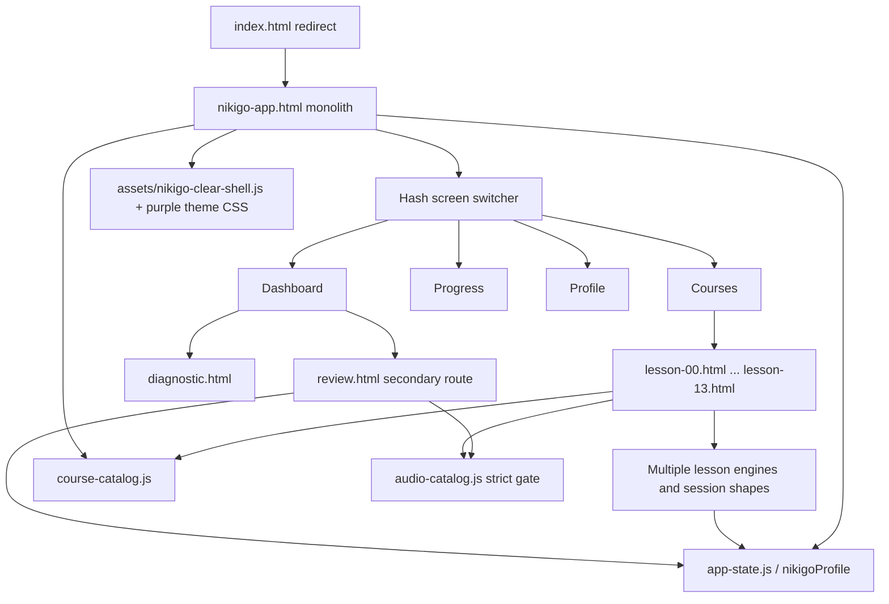
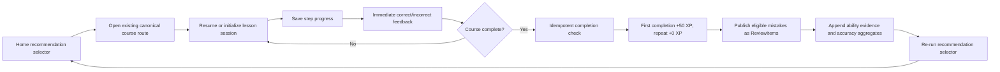
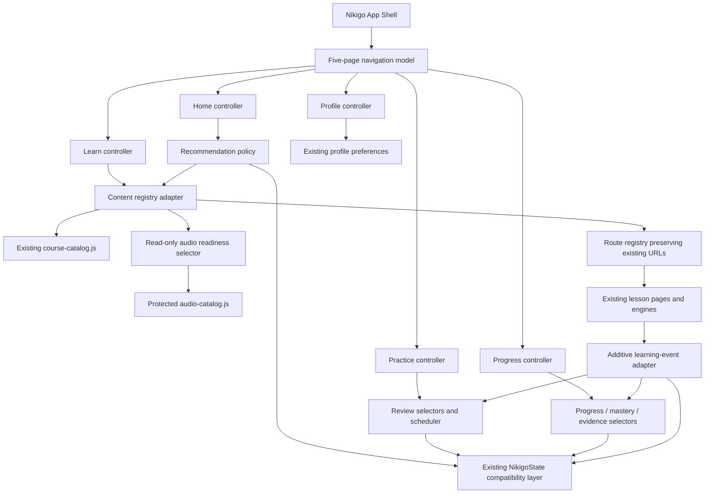

# Nikigo Product Architecture V1

> Stage 3A architecture review and implementation proposal
>
> Baseline: `40f3cc0ebc778d50f8d84b76ac4b7b6c680a4689`
>
> Working branch: `agent/nikigo-product-architecture-v1`
>
> Scope: information architecture, product state, content contracts, migration and phased implementation only. This document does not authorize course, audio or visual changes.

## 0. Executive decision

Nikigo can support the proposed five-part product architecture without changing any existing course identity, course content, answer, audio record or progress key. The safe implementation path is additive:

1. keep `course-catalog.js`, `app-state.js`, all lesson pages/engines and `audio-catalog.js` as the current compatibility layer;
2. add read-only adapters and selectors for content hierarchy, recommendation, resume, review, mastery and navigation;
3. promote the existing review experience into the top-level **练习** responsibility;
4. turn the current four-screen app shell into a five-responsibility shell while preserving current lesson URLs and hash links;
5. only after compatibility tests pass, let lesson engines emit a common learning-event contract.

The most important current gaps are not missing course pages. They are:

- the home recommendation only finds the first unfinished catalog lesson; it does not select an unfinished session first or elevate a due review;
- review is a separate secondary page instead of a first-class Practice responsibility;
- course completion, XP and session progress are implemented independently across several engines;
- global review items are published mainly by Lessons 1–3, so later-course mistakes are usually local to a lesson session;
- `skillTags`, accuracy evidence, diagnosis state, last activity and stage completion are not consistently modeled;
- `nikigo-app.html` owns navigation, rendering, copy and route switching in one file.

No existing stable ID should be renamed or renumbered. Course number remains recommendation order, never an access gate. Every currently `available` course remains freely enterable.

## 1. Verified baseline and constraints

### 1.1 Repository baseline

- Local and remote-tracking baseline both resolve to `40f3cc0ebc778d50f8d84b76ac4b7b6c680a4689` on `agent/restore-nicki-academy-layout`.
- Stage 3A branch is created directly from that commit: `agent/nikigo-product-architecture-v1`.
- The separate primary worktree remains on `feature/lesson-07-batch-2b` with its existing untracked `CODEX_HANDOFF.md` untouched.
- `CODEX_HANDOFF.md` is not modified by this stage.

### 1.2 Protected runtime baseline

At the start of Stage 3A:

- `audio-catalog.js` contains 83 records: 54 exact approved/playable records and 29 pending/non-playable records.
- `approvedAssetHashes` contains exactly 54 hashes.
- The repository contains 66 MP3/WAV files, including files not counted as approved release records.
- There is no diff from `40f3cc0` in MP3/WAV files, `audio-catalog.js`, `course-catalog.js` or `app-state.js`.
- No API request, paid service, deployment or main merge is part of Stage 3A.

The number **54** refers to approved, exact-playable catalog assets—not the total count of catalog records or audio files on disk.

## 2. Proposed first-level navigation

| First-level page | User question | Product responsibility | Current support | Required reorganization |
| --- | --- | --- | --- | --- |
| 首页 | 我现在应该学什么？ | Select and explain exactly one strongest next action | Partial | Replace first-uncompleted-only logic with a priority selector; keep progress summaries secondary |
| 学习 | 我可以学什么？ | Recommended path and all released courses grouped by Stage and Chapter/Module | Mostly | Rename current “课程” responsibility to “学习”; replace the flat long list with an explicitly approved Stage → Chapter/Module hierarchy |
| 练习 | 我现在应该复习什么？ | Due review, mistakes, relearning and later practice/game runtimes | Partial, hidden | Promote `review.html` into the first-level IA; add sources/filters without inventing games or vocabulary entries |
| 进度 | 我学会了什么，有什么证据？ | Course completion, history, accuracy, mastery and skill evidence | Partial | Keep current completion/XP data; add evidence and mastery only when backed by recorded events |
| 我的 | Nikigo 怎样配合我的学习？ | Four-language preference, goal, audio, account and personal settings | Mostly | Keep settings; move placement/learning-plan actions to an appropriate learning setup section if needed |

### Navigation rules

- Desktop: five first-level items in one product navigation.
- Mobile: five destinations may use the existing compact bottom-navigation pattern, but labels and active state must remain perceivable; content must retain bottom safe-area padding.
- `首页` is a decision surface, not a second course catalog.
- `首页` shows the current localized stage/module context, one continue action and one complete-path entry; it does not show the full course list.
- `学习` owns browsing and free entry, grouped by Stage and Chapter/Module rather than one flat long list.
- The current stage and current module are expanded by default; other modules may collapse.
- Every module shows a localized name/objective and completed/total lesson counts; its lessons remain ordered by catalog `displayOrder`.
- `练习` owns review workload and retry flows; it does not own primary course progression.
- `进度` reports evidence; it does not recommend multiple competing actions.
- `我的` owns preferences and account settings; it does not become a miscellaneous feature drawer.
- No Vocabulary or Game navigation item is created until real approved content exists.

## 3. Current architecture



### Current strengths

- Stable course identities and canonical page files already exist for Lessons 0–13.
- Catalog order, release state, access state, prerequisites and audio state are separate concepts.
- All current `available` lessons are free-entry; prerequisites are recommendations only.
- State normalization, four-language preference, review scheduling and the Lesson 4/7 identity migration already exist.
- Audio playback fails closed and requires an exact approved catalog match.
- Lessons preserve progress with profile percentages and/or lesson session keys; developed completion flows preserve first-completion `+50 XP` and repeat `+0 XP` semantics.

### Current structural limits

- `nikigo-app.html` combines shell, five onboarding/dashboard concerns, localized copy, screen rendering and routing.
- Main screen identity is hardcoded to `dashboard`, `courses`, `progress`, `profile`; Practice has no first-level screen.
- Lesson-to-app return routes are repeated across engines.
- Course completion and one-time XP are guarded independently by each engine through `completedLessons` membership; there is no central event/award ledger.
- Lesson session formats and step keys differ by engine.
- Review scheduling exists, but ReviewItem publication is incomplete across later lessons.
- Ability values are a six-number profile array, not an evidence ledger tied to content, attempts or dates.
- There is no dependable `lastActivityAt`, diagnostic lifecycle, course-attempt history or recommendation snapshot.

## 4. True current course inventory: Lessons 0–13

### 4.1 Reading rules for this inventory

- “Available” is verified from both catalog state and the existence of the canonical page/entry.
- “Steps” reports the current runtime structure. Lesson 0 is intentionally nonlinear and has no step array.
- “XP” is the catalog/completion award. Lesson 0 awards 0. Lessons 1–13 specify 50, but Lesson 6 currently blocks formal completion while its required release audio is unavailable.
- “Skill tags” are **not currently modeled** in the catalog. The template column is included as factual implementation metadata; it must not be silently converted into mastery tags.
- “Relearn” means a user can re-enter/reset the lesson flow without receiving the first-completion award again.
- “Resume” means the current implementation retains lesson progress/session state across refresh or return. Lesson 0 only retains its orientation/start-point choice and is not a linear resumable lesson.
- “Audio dependency” distinguishes actual catalog readiness from the coarse course-level `audioStatus: pending`, which is currently `pending` for every course.

| Order | stableId | Current title | Canonical entry | Release/access | Steps | XP | Current template; skill tags | Relearn | Resume | Audio dependency/readiness |
| ---: | --- | --- | --- | --- | ---: | ---: | --- | --- | --- | --- |
| 0 | `lesson-00` | 先认识韩文字母地图 | `lesson-00.html` + `lesson-00.js` | available / available | Nonlinear map; 40 interactive letters + 3 start choices | 0 | `hangul-map`; `skillTags` absent | Re-entry | Start choice only | Own namespace 3/3 approved; other exact cross-lesson examples may resolve, all unmatched actions stay disabled |
| 1 | `lesson-01` | 核心元音 ㅏㅓㅗㅜㅡㅣ | `lesson-01.html` + `lesson-engine.js` | available / available | 15 | 50 | `hangul-foundation`; `skillTags` absent | Yes | Yes | 12/12 approved |
| 2 | `lesson-02` | 其余基础元音和易混元音 | `lesson-02.html` + `lesson-engine.js` | available / available | 16 | 50 | `hangul-to-words`; `skillTags` absent | Yes | Yes | 12/13 playable; 1 pending |
| 3 | `lesson-03` | 高频基础辅音：通过完整音节学习 | `lesson-03.html` + `lesson-engine.js` | available / available | 17 | 50 | `hangul-to-scenario`; `skillTags` absent | Yes | Yes | 11/11 approved |
| 4 | `lesson-04` | 听懂普通音、送气音和紧音 | `lesson-04.html` + `lesson-consonant-contrast.js` | available / available | 15 | 50 | `consonant-contrast`; `skillTags` absent | Yes | Yes | Canonical engine uses legacy `k0-consonant-contrast`: 14/14 approved. Secondary `lesson-04` namespace is 1/10 playable |
| 5 | `lesson-05` | 看懂韩语音节块 | `lesson-05.html` + `lesson-05.js` | available / available | 16 | 50 | `syllable-blocks`; `skillTags` absent | Yes | Yes | 1/1 approved; unmatched requests fail closed |
| 6 | `lesson-06` | 复合元音 | `lesson-06.html` + `lesson-06.js` | available / available | 18 | 50 configured | `compound-vowels`; `skillTags` absent | Preview restart | Yes, preview state | 0/15 playable. Formal completion and XP are deliberately blocked until audio release readiness is true |
| 7 | `lesson-07` | 四个基础收音 ㄴㅁㅇㄹ | `lesson-07.html` + `lesson-07.js` | available / available | 13 | 50 | `hangul-batchim`; `skillTags` absent | Yes | Yes | Own namespace 0/4 playable; unavailable controls remain disabled. Approved base syllable may resolve through legacy namespace; course completion remains allowed |
| 8 | `lesson-08` | 七种代表收音和常见音变 | `lesson-08.html` + `lesson-08.js` + `lesson-sprint-engine.js` | available / available | 15 | 50 | `pronunciation`; `skillTags` absent | Yes | Yes | No lesson-specific catalog namespace; lesson explicitly avoids unreviewed audio; any unresolved request fails closed |
| 9 | `lesson-09` | 场景韩语：问候与介绍 | `lesson-09.html` + `lesson-09.js` + `lesson-sprint-engine.js` | available / available | 15 | 50 | `scenario-dialogue`; `skillTags` absent | Yes | Yes | Reuses exact approved Lesson 3 greetings where declared; Lesson 9-specific requests are unavailable and disabled |
| 10 | `lesson-10` | K0阶段复习挑战 | `lesson-10.html` + `lesson-10.js` + `lesson-sprint-engine.js` | available / available | 15 | 50 | `review-challenge`; `skillTags` absent | Yes | Yes | Reuses exact approved Lesson 4/legacy contrast audio where declared; no own namespace |
| 11 | `lesson-11` | 姓名与身份 | `lesson-11.html` + `lesson-11.js` + `lesson-clear-interactive.js` | available / available | 13 | 50 | `scenario-dialogue`; `skillTags` absent | Yes | Yes | No own catalog namespace; declared sentence audio is pending and remains disabled |
| 12 | `lesson-12` | 国家与语言 | `lesson-12.html` + `lesson-12.js` + `lesson-sprint-engine.js` | available / available | 13 | 50 | `scenario-dialogue`; `skillTags` absent | Yes | Yes | No own catalog namespace; declared sentence audio is pending and remains disabled |
| 13 | `lesson-13` | 固有数词1～10与基础数量 | `lesson-13.html` + `lesson-13.js` + `lesson-sprint-engine.js` | available / available | 13 | 50 | `number-practice`; `skillTags` absent | Yes | Yes | No own catalog namespace; unresolved audio is never replaced with device TTS |

### 4.2 Inventory findings

- The directory and catalog contain a real, complete 0–13 set; there are no missing or coming-soon entries in that range.
- Lessons 0–10 are currently assigned to K0; Lessons 11–13 to K1.
- `recommendedPrerequisites` form the chain `lesson-00` → … → `lesson-13`, but all entries have `requiresCompletion: false` and `accessStatus: available`.
- Current completion UX and test evidence support repeat completion without duplicate course XP for Lessons 1–5 and 7–13. Lesson 6 is a deliberate preview exception because formal completion is audio-gated.
- Review catalog content exists only for Lessons 1, 2, 3 and 7 (29 definitions total). The shared Lesson 1–3 engine publishes review items; later engines generally keep mistakes inside their own session and do not yet publish global ReviewItems.

## 5. Content hierarchy

```text
Program
└── Stage
    └── Chapter
        └── Lesson / Mission
            └── Step
                └── Exercise
                    └── ReviewItem
```

### Identity decisions

- `Program`: one Korean program may be represented as `korean`; this is a new parent identity and does not change any lesson ID.
- `Stage`: adapt the existing `path` values K0 and K1 to `stageId`. K2–K4 remain reserved state values, not claims of released content.
- `Chapter`: no current catalog chapter identity exists. During migration, `chapterId` must be nullable. Chapter assignment requires approved content taxonomy; it must not be guessed from lesson titles.
- `Lesson / Mission`: reuse `stableId` exactly (`lesson-00` … `lesson-13`). `contentType` changes behavior/capability, not identity.
- `Step`: use existing stable step IDs where present. For older/custom engines, add an adapter before changing stored session positions.
- `Exercise`: preserve current exercise IDs where present; do not synthesize IDs that would collide with current review IDs.
- `ReviewItem`: preserve current IDs such as `lesson01:quiz:0`; link each item to `contentId`/legacy `lessonId` without renaming stored IDs.

Display number and `displayOrder` remain presentation/recommendation metadata only. They must never become entitlement or progression gates.

Phase 3B.1.5 produced the approved, explicit, versioned Stage/Chapter map in `NIKIGO_STAGE_CHAPTER_TAXONOMY_V1.md`. Phase 3B.2 may adapt it into runtime descriptors without changing `course-catalog.js`; title/template inference remains forbidden.

## 6. Four reusable content types

These types share one platform contract but do not share a mandatory seven-step UI.

| Type | Purpose | Current compatible examples | Runtime requirements | Not included now |
| --- | --- | --- | --- | --- |
| `foundation-lesson` | Letters, vowels, consonants, syllables, batchim and sound change | Current foundation-oriented Lessons 0–8 can be adapted after taxonomy approval | Concept/recognition/build/listening exercises; resumable steps where linear; exact audio gate | Rewriting current lesson content or forcing one step count |
| `scenario-mission` | Goal-led language use in a setting | Current `scenario-dialogue` Lessons 9, 11 and 12 | Scene context, role/choice exercises, completion and review publishing | New restaurant, transit, hotel, social or work content |
| `vocabulary-session` | Future word acquisition and spaced recall | None released | Word content records, exposure/recall evidence and ReviewItems through the common contract | A page, route, nav item or invented word list |
| `practice-game` | Mistakes, due reviews, listening/building/matching and future progression | Existing `review.html`; Lesson 10 is a course-like review challenge | May consume ReviewItems; must report attempts/evidence; XP policy explicit per activity | A formal game hub, map or new game content |

### Common content descriptor

The first implementation should be an adapter around `course-catalog.js`, not a replacement for it.

```ts
type ContentType =
  | 'foundation-lesson'
  | 'scenario-mission'
  | 'vocabulary-session'
  | 'practice-game';

interface ContentDescriptor {
  stableId: string;                 // existing lesson stableId remains canonical
  contentType: ContentType;
  programId: 'korean';
  stageId: string;                  // initially adapted from course.path
  chapterId: string | null;         // null until an approved chapter taxonomy exists
  displayOrder: number;
  displayNumber: number;
  route: string;                    // initially the existing canonical file
  template: string;                 // current engine/template identity
  releaseStatus: 'available' | 'coming-soon' | 'missing';
  accessStatus: 'available' | string;
  title: Record<'zh' | 'en' | 'vi' | 'ja', string>;
  estimatedMinutes: number;         // adapter from current duration
  xp: number;
  skillTags: string[];              // empty until content-owner-approved metadata exists
  recommendedPrerequisites: string[];
  recommendedNext: string[];        // optional editorial override, never an access gate
  audioStatus: AudioReadiness;
  capabilities: {
    resume: boolean;
    relearn: boolean;
    retryMistakes: boolean;
    publishesReviewItems: boolean;
  };
}

interface AudioReadiness {
  policy: 'exact-approved-only';
  required: number | null;
  playable: number;
  pending: number;
  completionGate: 'none' | 'required-audio';
}
```

`contentType` mapping must be an explicit reviewed map. It must not be inferred at runtime from title text. Future Vocabulary and Game descriptors may implement this contract only after real content receives stable IDs and routes.

### Common user-content state

Do not replace the existing `nikigoProfile` schema in one migration. First derive this view from current fields and lesson sessions; persist new fields only after compatibility tests.

```ts
interface UserContentState {
  contentId: string;
  status: 'not-started' | 'in-progress' | 'completed';
  percent: number;
  currentStepId: string | null;
  currentStepIndex: number | null;
  lastActivityAt: string | null;
  attemptCount: number;
  correctCount: number;
  incorrectCount: number;
  accuracy: number | null;
  mistakeIds: string[];
  firstCompletedAt: string | null;
  xpAwarded: number;
  mastery: number | null;
}
```

### Common learning events

```ts
type LearningEvent =
  | { type: 'content_started'; contentId: string; at: string }
  | { type: 'step_saved'; contentId: string; stepId: string; stepIndex: number; percent: number; at: string }
  | { type: 'exercise_answered'; contentId: string; exerciseId: string; correct: boolean; skillTags: string[]; at: string }
  | { type: 'review_published'; contentId: string; reviewItemIds: string[]; at: string }
  | { type: 'content_completed'; contentId: string; attemptId: string; at: string }
  | { type: 'content_restarted'; contentId: string; at: string };
```

The event adapter does not own lesson copy, answer keys or audio playback. It reports learning outcomes to the existing state layer. A central completion service may later make the current `completedLessons`-membership rule idempotent, but its first release must preserve exactly: first completion `+50 XP`, repeat completion `+0 XP`, and Lesson 6’s audio completion gate.

## 7. User states and home recommendation policy

### 7.1 State definitions

| User state | Detectable now? | Proposed definition | Home treatment |
| --- | --- | --- | --- |
| 全新用户 | Yes | Required language/path/starting-point setup is incomplete | Primary: complete only the required setup; do not pretend a course history exists |
| 零基础用户 | Partial | `hangulLevel === 'beginner'` or explicitly selected K0 starting point | Primary after required setup: an active resumable course, due review, or the next suitable available foundation lesson in that order |
| 有基础但未诊断用户 | No, not reliably | Basic/reader self-report with `diagnosis.status === 'not-started'` and no validated placement result | Primary: optional/explicit placement action; free course browsing remains available |
| 有当前活跃的未完成课程 | Partial | An available unfinished course with an explicit resumable current session, a trustworthy `lastActivityAt`, or another reliable recent-activity signal | Primary: resume exactly that one course and step |
| 有历史未完成课程 | Yes | One or more available courses have progress `>0 && <100`, but none can be identified reliably as current | Show only in the secondary “学习中” area; do not use one as the primary action by guessing |
| 有到期复习任务 | Yes | `NikigoState.dueReviews()` returns at least one active item | Primary when there is no required setup and no reliably active unfinished course |
| 已完成当前推荐课程 | Not persisted | Prior recommendation content transitions to completed; selector recalculates | Primary: next recommended available lesson, or due review if now higher priority |
| 已完成当前阶段 | Derivable, incomplete lifecycle | Every released/available content item assigned to current stage is completed | Primary: stage summary/next approved stage action; never invent unreleased content |

Required additive state for reliable classification:

```ts
interface DiagnosisState {
  status: 'not-started' | 'in-progress' | 'completed' | 'skipped';
  resultId: string | null;
  recommendedStageId: string | null;
  completedAt: string | null;
}

interface RecommendationSnapshot {
  kind: 'resume' | 'review' | 'next-content' | 'free-choice' | 'setup' | 'diagnosis' | 'stage-complete';
  contentId: string | null;
  route: string;
  reasonKey: string;
  priority: number;
  generatedAt: string;
}
```

### 7.2 Single-primary-action policy

The approved home recommendation priority is:

```text
required setup
→ active unfinished course
→ due review
→ recommended next available course
→ free course choice
```

Deterministic selector:

1. If required language, path or starting-point setup is incomplete, return the required setup action.
2. Find an available unfinished course only when it has a reliable active signal:
   - an explicit current resumable lesson session; or
   - a trustworthy `lastActivityAt`; or
   - another source that reliably identifies it as the user’s most recent learning activity.
3. If exactly one course is reliably current, return its resume action.
4. If multiple historical unfinished courses exist but none has a reliable activity signal, do not choose by title, highest progress, display order or any other guess. Keep them in a secondary “学习中” collection and continue to the next rule.
5. Return the due-review action when `dueReviews().length > 0`.
6. If none, return the first not-completed, formally completable `available` item in the user’s recommended path/stage.
7. If every released/available, formally completable item in the stage is complete, return a stage-complete action backed by real catalog data.
8. If no path recommendation can be formed, return free course choice.

Rules:

- The selector returns one `primaryAction`, one reason and optional non-primary context. It must never render two equal-weight primary buttons.
- Historical unfinished courses without a reliable active signal are secondary context only and cannot displace a due review.
- `recommendedPrerequisites` influence ranking/explanation only; they never disable available content.
- Diagnosis may be the primary setup action for an explicitly self-identified non-beginner, but it cannot block free course access.
- Pending audio may change the recommendation rank or explain limitations. It cannot silently bypass the exact-audio gate.
- Lesson 6 must not be recommended as a formally completable lesson while its required-audio completion gate is closed. It remains freely enterable from Learn and must be labeled as preview/audio-in-preparation wherever shown; it cannot receive formal completion or XP.
- Every catalog course whose access is `available` remains freely enterable from Learn, independent of recommendation ranking.

## 8. Learning loop and ownership



The loop preserves:

- refresh/back recovery through current profile and lesson-session storage;
- wrong-answer retry inside the current lesson;
- global due review through the current review scheduler;
- explicit relearning without erasing prior completion or awarding course XP twice;
- interface/learning language `zh`, `en`, `vi`, `ja`;
- free entry for every `available` course;
- strict audio resolution and pending/missing controls;
- current Lesson 4/7 identity migration and unknown-field preservation.

### Data ownership today and proposed boundary

| Data | Current owner | Current issue | Proposed additive owner/boundary |
| --- | --- | --- | --- |
| Course identity | `course-catalog.js`, repeated in lesson configs | Repetition can drift | `content-registry.js` adapter validates catalog ↔ runtime identity; catalog stableId remains source |
| Display order/number | `course-catalog.js` | Currently also used by simplistic next selector | Catalog remains source; recommendation policy treats it as ranking only |
| Course steps/exercises | Per-course HTML/JS config and several engines | Different session schemas | Content runtime adapters expose common capability/event methods without rewriting content |
| User progress | `app-state.js` `lessonProgress`, `completedLessons`; per-lesson session keys | No timestamp/history/common step identity | `progress-selectors.js` derives status; later schema adds last activity/evidence additively |
| XP | `app-state.js` total; completion logic duplicated in engines | No central award ledger | Completion service validates idempotency while preserving existing total and course semantics |
| Mistakes/review | `app-state.js` + `review-catalog.js` + `review.html`; lesson session mistakes | Later engines do not consistently publish | Review publisher adapter writes current ReviewItem shape; Practice reads one selector |
| Four languages | App/lesson copy maps and `app-state.js` language fields | Copy is distributed but functional | Keep language IDs and fallback behavior; contracts carry localized title/copy keys |
| Audio status | `audio-catalog.js` exact gate; coarse `course-catalog.js.audioStatus` | Course-level `pending` hides per-item readiness | Read-only `audio-readiness.js` selector derives counts/gate; audio catalog remains authoritative |
| Page visual | Purple theme CSS, per-lesson CSS, `assets/nikigo-clear-shell.js` | Multiple layers but accepted baseline | Preserve; architecture changes use existing tokens/classes and do not start a redesign |
| Routing | `index.html`, `nikigo-app.html` hash switcher, direct lesson/review/diagnostic URLs | Route logic repeated | `route-registry.js` centralizes destinations while preserving all canonical URLs and hashes |

## 9. Proposed architecture



### Layer rules

- **Catalog layer** says what content exists, its identity, order and access/release metadata.
- **Content registry adapter** adds hierarchy/type/capabilities without mutating existing course data during the first migration.
- **State compatibility layer** remains `NikigoState` schema v4 until migration tests approve a version increment.
- **Selectors** are pure/read-only: page models, recommendation, due practice, stage completion, audio readiness.
- **Services** perform scoped writes: progress event, completion award, review publication.
- **UI controllers** consume view models and do not recompute domain rules.
- **Lesson runtimes** keep their present content and interaction; adapters normalize events at their boundary.

## 10. Page responsibilities

| Page | User goal | Most important information | Primary action | Secondary actions | State that must remain | Must not appear |
| --- | --- | --- | --- | --- | --- | --- |
| Dashboard | Know what to do now | One recommendation, reason, exact resume/lesson/review context | Resume / review / start next—exactly one | View K0 path, see compact streak/XP/goal/week summaries | Language, current path, progress, due count, XP, streak | Full settings, equal-weight course grid, multiple competing CTAs, unreleased future modules |
| 学习 / 全部课程 | Browse and freely enter learning content | Recommended path plus truthful complete catalog and release/audio limitations | Enter selected available content | Filter by stage/type; view details | Completion %, availability, stable route, recommendation order | Review queue management, account/legal settings, fake vocabulary/game entries |
| 练习 / 复习中心 | Clear the most useful practice workload | Due count, source lesson, review type, readiness/empty state | Start due review | Review mistakes, relearn a completed course, later choose approved practice type | ReviewItem mastery, due time, attempts, language, exact audio gate | Full course catalog, invented game levels, formal mastery claims without evidence |
| 进度 / 能力报告 | Understand progress and evidence | Completion, learning history, accuracy and skill evidence with data coverage | Inspect a stage/skill record | Open a completed course or related review | XP, completed IDs, progress %, evidence provenance and dates | Primary learning recommendation, settings, unsupported skill scores presented as fact |
| 我的 / 设置 | Adjust how Nikigo works | Language, learning goal, audio and account preferences | Save the changed setting | Placement setup, privacy/support/account actions | Four-language selection, time goal, audio rate/autoplay, identity | Course cards, review workload, XP celebration as main content |
| 课程开始页 | Decide whether to start/resume this content | Goal, type, estimated time, stage, audio limitations, existing progress | Start or resume | Return to Learn; choose relearn if already completed | contentId, language, prior completion, resume position, audio gate | Full dashboard metrics, unrelated recommendations, answer keys |
| 课程进行页 | Complete the current step with confidence | Step content, progress, task instruction, immediate feedback | Submit/continue/play when available | Back, exit safely, retry mistake | Session position, answers, mistakes, language, playback preference, history state | Global nav competing with task, future course promotion, XP before completion |
| 课程完成页 | Understand result and next consequence | Completion status, first/repeat XP truth, mistakes/review added, evidence recorded | Return to the single recommended next action | Relearn; open review; return to Learn | Prior completion, XP idempotency, accuracy, review publication, language | Always showing +50, multiple primary CTAs, claims of mastery unsupported by evidence |

There is no dedicated course-start page today; canonical lesson URLs enter the lesson flow directly. A start state can first be implemented as an engine capability/view without changing the URLs.

## 11. What can be preserved

Keep as authoritative or compatibility-critical:

- every current `stableId`, display number, title, canonical lesson filename and current lesson content;
- independent `releaseStatus`, `accessStatus`, `recommendedPrerequisites`, `requiresCompletion` and `audioStatus` concepts;
- all current `available` free-entry behavior;
- `app-state.js` normalization, unknown-field preservation, four-language values, review scheduler and Lesson 4/7 identity migration;
- current lesson engines and session storage during the adapter phase;
- current correct/incorrect feedback, retry, back/refresh recovery and relearning controls;
- `completedLessons` as the compatibility idempotency signal for course XP;
- current `+50` first completion and `+0` repeat completion contract;
- `audio-catalog.js`, its 54 approved hashes, exact-match gate and no-device-TTS policy;
- the accepted purple/white visual system and `assets/nikigo-clear-shell.js` presentation layer;
- existing canonical routes and PWA cache strategy until a controlled additive resource update.

## 12. What needs restructuring

### High priority

1. Extract a pure recommendation policy from Dashboard rendering.
2. Add a navigation model with first-class Practice responsibility.
3. Add a content-registry adapter for hierarchy, type and capabilities while leaving catalog identities intact.
4. Add read-only progress, stage completion and audio-readiness selectors.
5. Centralize route lookup while preserving every current URL/hash.

### Medium priority

6. Add common learning events at engine boundaries.
7. Normalize global ReviewItem publication for eligible mistakes from every content runtime.
8. Add attempt/accuracy/evidence records, with explicit coverage labels when old activity has no evidence.
9. Centralize completion award idempotency only after parity tests prove every engine’s current behavior.

### Deferred

10. Add approved chapter taxonomy and `skillTags` with content-owner review.
11. Add Vocabulary Session content and UI.
12. Add Practice/Game content and progression.
13. Replace all legacy lesson session formats. Compatibility adapters should remain until old user state is safely migrated.

## 13. State migration and regression risks

| Risk | Why it matters | Required mitigation |
| --- | --- | --- |
| Lesson 4/7 identity remap runs incorrectly | Could swap completion, sessions or review items | Preserve current migration key and mapping; add fixtures for pre-migration, migrated and mixed state |
| XP awarded twice | Multiple engines implement completion independently | Keep `completedLessons` guard; add idempotency tests before routing completion through a service |
| Lesson 6 becomes falsely complete | Its formal completion is intentionally audio-gated | Model `completionGate`; keep preview-finished distinct from completed |
| Existing session no longer resumes | Engines store different session shapes and history state | Adapter reads legacy keys; do not rename/delete session keys in the first release |
| New recommendation hides due work or free entry | Ranking and access can be confused | Selector tests enforce priority and ensure available courses remain clickable in Learn |
| Review queue appears more complete than it is | Only a subset of engines currently publishes global review items | Label data coverage; add publishers prospectively; never infer historical mistakes |
| Ability report invents mastery | Current generic six-number ability array lacks evidence provenance | Show legacy score as legacy/diagnostic where applicable; add evidence only from recorded events |
| `skillTags` guessed from names | Taxonomy errors become durable state | Start with empty tags; approve an explicit mapping separately |
| Audio readiness regresses | Coarse course status can contradict item-level gate | Derive readiness read-only from `NikigoAudio`; never copy or rewrite SHA/catalog records |
| Four-language copy fragments | Navigation/page split may introduce untranslated strings | Require four keys for every new UI string and test fallback/visible labels in zh/en/vi/ja |
| Hash/deep-link breakage | Existing bookmarks and lesson returns use direct URLs/hashes | Central registry preserves `#dashboard/#courses/#progress/#profile`, direct lesson, review and diagnostic routes during migration |
| Service worker serves mixed shell | New modules may not be in the cache manifest | Change `sw.js` only when modules are introduced; preserve cache lifecycle and verify online/offline behavior |

### Migration policy

- Use additive fields and adapters; never delete unknown stored fields.
- Do not rename existing stable IDs, ReviewItem IDs or session keys.
- Read legacy state first; write new fields only after normalization.
- Keep rollback possible by allowing the old UI to ignore new fields.
- Do not backfill accuracy, mastery, last activity or skill evidence from guesses.
- Version any persisted schema only with fixture tests for fresh, v4, pre-Lesson-4/7 migration and partially populated users.

## 14. Phased implementation plan

### Phase 3B.1 — Contracts and pure selectors

- Add only `content-registry.js`, `content-type-map.js`, `route-registry.js`, `recommendation-policy.js`, `progress-selectors.js` and `audio-readiness.js` plus pure-function tests and an architecture validation script.
- Implement the approved one-primary-action policy: required setup → reliably active unfinished course → due review → recommended next formally completable available course → free choice.
- Preserve `#courses` and the other current routes through compatibility mappings; do not change visible navigation.
- Verify four-language keys for every new recommendation reason/action label.
- Do not change visible UI, course pages, lesson engines, state storage, ReviewItem publication, course content, audio data or the purple/white visual system.
- Acceptance includes all 12 approved scenario groups: setup, explicit active session, due review, ambiguous historical unfinished courses, next available, stage complete, free choice, Lesson 6 gate, 14-course free access, catalog identity/route parity, legacy route aliases and four-language key completeness.

### Phase 3B.1.5 — Stage and Chapter Taxonomy Approval

- Review Lessons 0–13 against their real content, not title inference.
- Approve explicit four-language stage names, chapter IDs/names/goals, lesson memberships, module display order, completion conditions, gate states and future expansion rules.
- Keep `course-catalog.js`, runtime content descriptors, course content, state and visible UI unchanged.
- Record the approved `nikigo-taxonomy-v1` map and product decisions in `NIKIGO_STAGE_CHAPTER_TAXONOMY_V1.md`.
- No Stage/Chapter grouping is implemented in the Learn page during this phase.

### Phase 3B.2 — Five-page shell and responsibility split

- Add Practice as a first-level destination using the current real review data.
- Rename/reframe Courses as Learn while preserving `#courses` as a compatibility alias.
- Implement the approved explicit Stage → Chapter/Module → Lesson grouping; do not retain one flat long list as course count grows.
- Keep internal `K0`/`K1` IDs unchanged while showing localized “Stage 1 · Hangul Foundations” and “Stage 2 · Essential Korean” labels to users.
- Default-expand the current stage/module and allow other modules to collapse; show localized module goals and completed/total lesson counts.
- Model Lesson 6’s gated module as user-facing 3/4 plus audio-preparation status; never claim 4/4, formal completion or XP while its required-audio gate is closed, and never let that gate block later recommendations.
- Expose `taxonomyVersion`, `historicalCompletion`, `historicalCompletedAt`, `currentVersionProgress` and `newContentAvailable` through pure view models before any separately approved persistence migration.
- Connect Dashboard to exactly one recommendation view model.
- Keep current purple/white visual components; make only structural/class changes needed for IA.
- Acceptance: 390/768/1440 navigation, four languages, deep links, no overflow, keyboard focus, no console/network errors.

### Phase 3B.3 — Runtime event adapters

- Add non-invasive adapters to each engine family for start, step, answer, restart and completion events.
- Publish eligible mistakes into existing ReviewItem storage without changing answer keys.
- Preserve lesson-local retry behavior.
- Acceptance: Lessons 4, 7 and 11 plus representatives from every engine; refresh/back/relearn; first `+50`, repeat `+0`.

### Phase 3B.4 — Evidence and progress reporting

- Add prospective attempt/accuracy/evidence records.
- Report coverage honestly for legacy activity.
- Add stage completion and skill evidence views only for approved metadata.
- Acceptance: old profile fixtures, partial/new users, stage completion, no fabricated historical scores.

### Future, separately approved

- Chapter and skill taxonomy authoring.
- Vocabulary Session content/routes.
- Practice/Game content/routes and any game-specific XP policy.
- Broader session-schema consolidation.

## 15. Estimated implementation file list

Names below are proposed for Stage 3B and may be adjusted to existing project conventions. None is required to modify protected data in Stage 3A.

### New modules

- `content-registry.js` — adapter from current course catalog to common descriptors.
- `content-type-map.js` — explicit, reviewed type mapping; no title inference.
- `route-registry.js` — current hashes/direct URLs and compatibility aliases.
- `recommendation-policy.js` — pure one-primary-action selector.
- `progress-selectors.js` — resume, stage completion, coverage and evidence view models.
- `audio-readiness.js` — read-only exact-gate summary from `NikigoAudio`.
- `learning-events.js` — common event definitions/dispatcher.
- `practice-controller.js` — first-level Practice model using existing review data.
- `scripts/test-recommendation-policy.mjs`
- `scripts/test-content-registry.mjs`
- `scripts/test-state-compatibility.mjs`
- `scripts/validate-product-architecture.mjs`

After Phase 3B.1.5 approval, Phase 3B.2 may add `stage-chapter-taxonomy.js` as the explicit runtime map. It must not infer chapter IDs or skill tags from course titles.

### Existing files likely to receive scoped Stage 3B changes

- `nikigo-app.html` — five-page shell, page responsibility markup and compatibility hash routing.
- `review.html` — integrate with Practice entry while preserving standalone/deep-link behavior.
- `assets/nikigo-clear-shell.js` — presentation/navigation adaptation only.
- `lesson-engine.js`
- `lesson-sprint-engine.js`
- `lesson-clear-interactive.js`
- `lesson-consonant-contrast.js`
- `lesson-05.js`
- `lesson-06.js`
- `lesson-07.js` — event adapter calls only after engine-parity tests.
- `sw.js` — add new resources to the current cache logic only when introduced.
- `package.json` — add validation scripts only; no paid dependency or API integration.

### Protected or deferred files

- `course-catalog.js` — remain unchanged in the first adapter phase; later metadata additions require separate approval and parity tests.
- `app-state.js` — remain unchanged until the additive schema/migration is approved; business behavior must not be rewritten casually.
- `audio-catalog.js` — no data, status, SHA or gate changes.
- `audio/**/*.mp3`, `audio/**/*.wav` — no changes.
- `lesson-00.html` … `lesson-13.html` and course config content — no copy, answer or learning-content changes under this architecture stage.
- `CODEX_HANDOFF.md` — no changes.

## 16. Stage 3B acceptance gates

Before any Stage 3B branch is considered ready:

- 14/14 stable IDs, display orders, numbers and canonical routes match the current catalog.
- All 14 `available` courses remain freely enterable.
- A fresh user with incomplete required setup receives exactly one setup primary action.
- An explicit current resumable course outranks due review; an ambiguous historical unfinished course does not.
- When multiple historical unfinished courses have no reliable activity signal, the selector does not guess using title, progress or display order and returns due review when one is due.
- Without an active course or due review, the selector recommends the next formally completable available course in the approved path.
- Completed-stage and no-path/free-choice states return distinct, deterministic actions.
- Lesson 6 remains freely enterable but is excluded from formally completable recommendations while its required-audio gate is closed.
- The recommendation selector always returns exactly one `primaryAction`.
- `#dashboard`, `#courses`, `#progress`, `#profile`, direct lesson routes, review and diagnostic routes retain compatibility mappings.
- Every new user-facing key is complete in `zh`, `en`, `vi` and `ja`.
- Stage and module UI uses approved four-language names and objectives rather than exposing only K0/K1.
- Learn groups courses by explicit Stage/Chapter membership, expands the current stage/module by default and keeps other modules collapsible.
- Module progress shows completed and total lesson counts plus any completion-gate/preview state without converting gates into completion.
- Module ordering and course `displayOrder` affect display/recommendation only; all `available` course routes remain directly accessible.
- Four languages work across all five first-level responsibilities.
- Lessons 4, 7 and 11 retain interaction, retry, completion, relearning and restore behavior.
- Representative tests cover every engine family, not only the three named lessons.
- First course completion awards `+50 XP`; repeat completion awards `+0 XP`.
- Due review, wrong-answer scheduling and review retry retain current semantics; review-correct `+5 XP` remains a separate existing policy unless explicitly changed later.
- Lesson 6 remains preview/non-completable while its required audio gate is closed.
- 54 approved hashes and all MP3/WAV bytes remain unchanged.
- `npm test` and architecture-specific tests pass; `git diff --check` passes.
- 390/768/1440 layouts have no horizontal overflow; mobile navigation does not hide content.
- Keyboard navigation works; visible focus and accessible names remain intact.
- Console errors: 0. Unexpected network errors: 0. Paid/API calls: 0.
- No main merge and no deployment without explicit approval.

## 17. Approved product decisions

The product owner approved these decisions for implementation:

1. Five first-level responsibilities are `首页 / 学习 / 练习 / 进度 / 我的`, with no Vocabulary or Game entry until real approved content exists.
2. The home selector returns exactly one primary action with priority `required setup → reliably active unfinished course → due review → recommended next formally completable available course → free choice`.
3. Historical unfinished courses without a reliable recent-activity signal remain secondary and never displace due review through guessed ranking.
4. Lesson 6 remains freely enterable as preview/audio-in-preparation, but cannot be a formally completable recommendation or award formal completion/XP while its required-audio gate is closed.
5. Stage 3B starts with adapters, pure selectors and compatibility aliases. Phase 3B.1 does not rewrite `course-catalog.js`, `app-state.js`, lesson engines, `audio-catalog.js`, course content/answers, stable IDs, ReviewItem IDs or session keys.
6. Phase 3B.1.5 approves an explicit Stage/Chapter taxonomy before Phase 3B.2. Runtime code must not derive `chapterId` or `skillTags` from course titles, and the Learn page must not remain a single flat course list as content grows.
